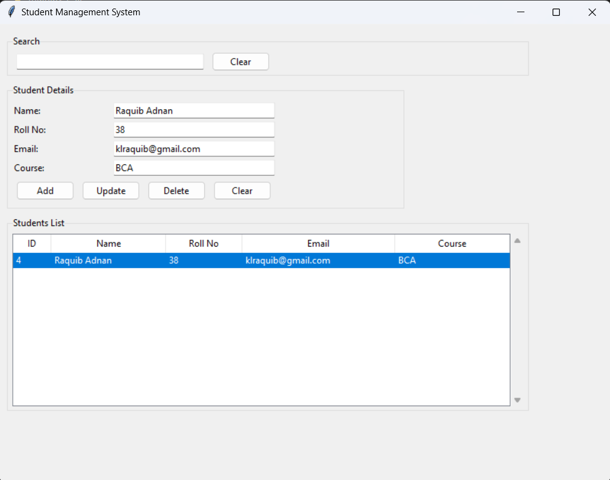

# Student Management System

A desktop application for managing student records using Python, Tkinter, and SQLite.

## ScreenShot

### Main Screen



## Features

- Add new students with validation
- View all students in a table format
- Update existing student records
- Delete student records
- Search students by name or roll number
- Form validation for required fields
- Email format validation
- Unique roll number and email constraints

## Requirements

- Python 3.x
- Tkinter (usually comes with Python)
- SQLite3 (usually comes with Python)

## Installation

1. Clone or download this repository
2. No additional installation required as all dependencies are built-in

## Usage

1. Run the application:
   ```bash
   python main.py
   ```

2. The application will create a SQLite database file (`students.db`) automatically

3. Features:
   - Use the form at the top to add new students
   - Select a student from the table to update or delete
   - Use the search bar to filter students by name or roll number
   - Click "Clear" to reset the form or search

## Form Fields

- Name: Student's full name (required)
- Roll No: Unique roll number (required)
- Email: Valid email address (required, unique)
- Course: Student's course (required)

## Validation

- All fields are required
- Email must be in valid format
- Roll number and email must be unique
- Confirmation dialog for delete operations
